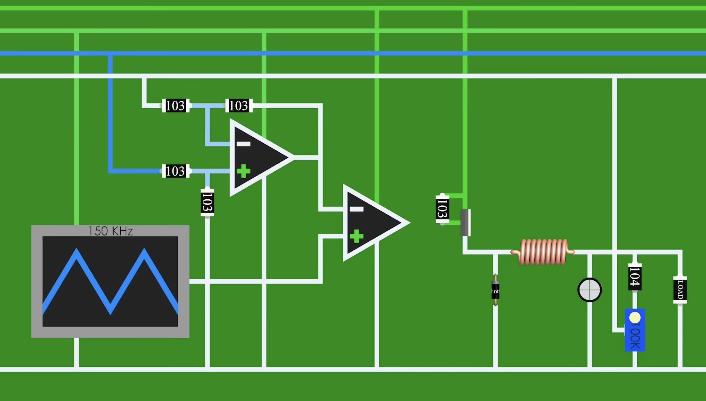

> **Related:** [[quick-context/pwm-controller-circuit]] | [[quick-context/diode]] | [[micro-context/pwm-pulse-width-modulation]] | [[quick-context/rc-oscillator]] | [[quick-context/self-induction]]

# Buck Converter

## Human notes

Make the ASCII diagrams clearer, in particular on the relationship between [[quick-context/transistor|MOSFET]] and [[quick-context/diode|diode]] — what is connected to the source, drain, and gate?

**Why does the [[quick-context/capacitor|output capacitor]] still smooth everything to 5V?** The inductor current has a sawtooth ripple — it ramps up during Phase 1 (switch ON) and ramps down during Phase 2 (switch OFF). The output capacitor acts as a reservoir: when inductor current is above the load's demand, the excess charges the capacitor; when inductor current dips below demand, the capacitor discharges to make up the difference. Because $V = Q/C$ and the capacitor has significant [[quick-context/capacitance|capacitance]], these tiny charge/discharge cycles produce only millivolts of ripple around the 5V average. The *average* voltage is set by the [[micro-context/pwm-pulse-width-modulation|duty cycle]] ($V_{OUT} = V_{IN} \times D$) — the capacitor doesn't *create* 5V, it just filters out the switching noise around that average.

**Who controls the [[micro-context/pwm-pulse-width-modulation|PWM]] and how is it connected?** A dedicated buck converter IC (e.g., TPS54302, LM2596, MP1584) contains the PWM controller — it's not the [[micro-context/stm32-microcontroller|MCU]]. The IC connects to VIN for its own power and to drive the [[micro-context/mosfet|MOSFET]] gate (often the MOSFET is integrated *inside* the IC). A [[quick-context/resistor|resistor]] divider from VOUT feeds back to the IC's feedback (FB) pin. The IC compares this to an internal voltage reference (~0.8V) and adjusts the duty cycle: if VOUT drops → longer ON time → more energy → voltage recovers. This closed-loop control runs autonomously at hundreds of kHz — no software involved.

> **See also:** [[quick-context/electric-current]] | [[quick-context/parallel-vs-series-voltage]] | [[quick-context/inductor]] | [[quick-context/capacitor]] | [[quick-context/pupper-bom-control-board]] | [[quick-context/pwm-controller-circuit]]

**Definition:** A switching power supply that efficiently steps down voltage (e.g., 12V battery → 5V for logic). Unlike linear regulators that waste excess voltage as heat, buck converters use rapid switching (100kHz–2MHz) and an inductor to achieve 85–95% efficiency.

---

## Circuit Topology


```
             GATE ◄── PWM controller
               │
          ┌────┴────┐                      INDUCTOR (L)
          │ N-MOSFET│                  ┌──────────────┐
  VIN ────┤D      S ├─────────┬────────┤   ~~~~~~     ├───┬──── VOUT
  (12V)   │         │         │        │   ~~~~~~     │   │     (5V)
          └─────────┘         │        └──────────────┘   │
           drain    source    │                         ┌─┴─┐
                              │  switch node (SW)       │   │ C
                              │                         │   │(output
                           ──┬── K (cathode)            └─┬─┘ cap)
                            ╲│                            │
                             │    DIODE (D)               │
                            ╱│    freewheeling            │
                           ──┴── A (anode)                │
                              │                           │
  GND ────────────────────────┴───────────────────────────┘


  MOSFET pins:                Diode terminals:
  ┌──────────────────────┐    ┌───────────────────────────┐
  │ DRAIN (D)  → VIN     │    │ CATHODE (K) → switch node │
  │ GATE  (G)  → PWM     │    │ ANODE   (A) → GND         │
  │ SOURCE (S) → SW node │    └───────────────────────────┘
  └──────────────────────┘

  The "switch node" — where 3 things meet:

      MOSFET SOURCE ──┬── INDUCTOR input
                      │
                DIODE CATHODE

  This junction swings between VIN (SW on) and ~−0.7V (SW off).
```

---

## How It Works: Two-Phase Operation

### Phase 1: Switch ON (Charging)

```
  GATE = HIGH → MOSFET ON (drain-to-source conducts)

          ┌─────────┐                    INDUCTOR
          │ N-MOSFET│                 ┌────────────┐
  VIN ════╡D═════ S ╞═════════╤═══════╡  ~~~~~~    ╞═══════╗
  (12V)   │  (ON)   │         │       │  ~~~~~~    │       ║
          └─────────┘         │       └────────────┘       ║
                       current║        energy stored       ║
                        ═══▶  ║        in field (↑)      ┌─╨─┐
                              ║                          │   │
                           ──┬── K                       │ L │
                            ╲│                           │ O │ LOAD
                             │  DIODE reverse            │ A │
                            ╱│  biased — OFF             │ D │
                           ──┴── A                       │   │
                              │   K is at ~VIN,          └─╥─┘
                              │   A is at GND →            ║
                              │   reverse biased           ║
  GND ════════════════════════╧════════════════════════════╝
                              ◀═══════════════ current


  Path: VIN → DRAIN → SOURCE → switch node → INDUCTOR → LOAD → GND
```

### Phase 2: Switch OFF (Discharging)

```
  GATE = LOW → MOSFET OFF (drain-to-source open)

          ┌─────────┐                     INDUCTOR
          │ N-MOSFET│                 ┌────────────┐
  VIN ────┤D  ×   S ├ · · · · ╤═══════╡  ~~~~~~    ╞═══════╗
  (12V)   │  (OFF)  │         │       │  ~~~~~~    │       ║
          └─────────┘         │       └────────────┘       ║
                        ═══▶  ║        releases            ║
                       current║        stored energy     ┌─╨─┐
                              ║        (B↓)              │   │
                           ══╤══ K                       │ L │
                            ╲║                           │ O │ LOAD
                             ║  DIODE now conducts       │ A │
                            ╱║  (freewheeling)           │ D │
                           ══╧══ A                       │   │
                              ║                          └─╥─┘
                              ║  SW node drops below       ║
                              ║  GND → forward biases D    ║
  GND ════════════════════════╩════════════════════════════╝
                              ◀═══════════════ current


  Path: switch node → INDUCTOR → LOAD → GND → DIODE (A→K) → switch node

  The inductor REFUSES to let current stop suddenly!
  Its collapsing magnetic field drives current through the diode.

  In Phase 2: can you explain why current flows through the diode now? Here's what's happening: during Phase 1, the [[quick-context/inductor|inductor]] was storing energy in its magnetic field while current flowed through it. When the MOSFET switches OFF, the inductor's current can't stop instantly — that's [[quick-context/self-induction|self-induction]] (a consequence of [[quick-context/lenzs-law|Lenz's law]]). The inductor's collapsing magnetic field generates a voltage that *fights* the current decrease, pulling the switch node voltage *below* GND. Once the switch node drops ~0.7V below GND, the [[quick-context/diode|diode]] becomes forward-biased (its cathode is now more negative than its anode at GND), so current flows: GND → diode anode → diode cathode → switch node → inductor → load → back to GND. The diode provides the return path that the inductor *demands*.
```

---

## Waveforms

```
     SWITCH STATE (GATE signal):
         ON      OFF     ON      OFF     ON
     ├────────┼────────┼────────┼────────┼────────┤
     │████████│        │████████│        │████████│
     │████████│        │████████│        │████████│
     └────────┴────────┴────────┴────────┴────────┘
         ton     toff      ton     toff
     ├─────────────────┤
          T (period)

     INDUCTOR CURRENT (IL):
                 ╱╲          ╱╲          ╱╲
               ╱    ╲      ╱    ╲      ╱    ╲
     ─────────╱────────╲──╱────────╲──╱────────╲───  ← ripple
             ╱          ╲╱          ╲╱          ╲      around
            ╱                                          average
           ramps up    ramps down
          (SW on)      (SW off)

     OUTPUT VOLTAGE (VOUT):
     ────────────────────────────────────────────── 5V (smooth)
          (capacitor filters the ripple)
```

---

## The Math

$$V_{OUT} = V_{IN} \times D$$

where $D = t_{on} / T$ is the duty cycle.

Example: 12V input, want 5V output → $D = 5/12 = 0.417$ (41.7% duty cycle). At 500kHz ($T = 2\mu s$): $t_{on} = 0.83\mu s$, $t_{off} = 1.17\mu s$.

---

## Why It's Efficient

```
     LINEAR REGULATOR:              BUCK CONVERTER:
     ─────────────────              ────────────────

     VIN ──┬── VOUT                 VIN ──[SW]──[INDUCTOR]── VOUT
           │                                │         │
        ┌──┴──┐                            [D]       [C]
        │ΔΔΔΔΔ│  ← transistor               │         │
        │ΔΔΔΔΔ│    always ON               GND       GND
        └──┬──┘    (partial)
           │                        • Switch: fully ON or fully OFF
           ▼                             (no in-between)
        HEAT!                       • INDUCTOR stores/releases energy
                                    • No wasted voltage drop!
     Power wasted = (VIN - VOUT) × I
     Example: (12V - 5V) × 1A = 7W of HEAT!    Power loss ≈ 5-15%
```

---

**Key insight:** The MOSFET's drain connects to VIN and its source connects to the "switch node," where it meets the diode's cathode and the inductor input. This three-way junction is the heart of the converter — it swings between VIN (switch on) and below GND (switch off, diode conducts). The inductor stores energy magnetically when the switch is ON and releases it when OFF, achieving 85–95% efficiency.

---

## Real Example — Pupper v3 Control Board

The Pupper v3 Control Board Rev 3.5 uses a textbook asynchronous buck. Open [pupper-control-board-interactive.html](pupper-control-board-interactive.html) and hover U8 / D1 / L1 / R5 / R6 to see wiring in-browser.

| Role in topology | Part on board | Value / designator |
|---|---|---|
| Buck IC (integrated high-side MOSFET + PWM controller) | TPS54561DPRR | **U8**, WSON-10 |
| Inductor (energy storage) | Sunlord MWSA1004S-100MT | **L1**, 10µH |
| Catch / freewheeling diode | SS56 Schottky | **D1**, SMA, 5A/60V, Vf≈0.5V |
| Output caps (ripple filter) | 2× 47µF X5R | **C18, C19**, 0805 |
| Feedback divider top | 60.4kΩ (E96) | **R5** |
| Feedback divider bottom | 11.5kΩ (E96) | **R6** |
| Battery input connector | 2-pin PH | **CN21** (7–24V VBAT) |

**Wiring (correct order — the board uses this exact topology):**

```
   CN21 (VBAT) ───► U8 VIN                              5V OUTPUT
                    │                                     ▲
                    │ (integrated MOSFET + PWM controller)│
                    ▼                                     │
                  U8 SW ───────┬──────► L1 (10µH) ────────┼────── to logic rail
                               │                          │
                          D1 cathode                  C18 ╪ C19 (47µF × 2)
                          ╲│                              │
                           │ D1 (SS56)                    ▼
                          ╱│                             GND
                          D1 anode
                               │
                              GND

   Feedback:  5V rail ── R5 (60.4k) ── U8 FB pin ── R6 (11.5k) ── GND
```

**D1 is NOT a series reverse-polarity diode.** CN21 connects directly to U8's VIN. D1 sits between U8's SW node and GND as the catch diode — it conducts only during the MOSFET off-phase (Phase 2 above), when L1's collapsing field pulls SW below GND.

**Output voltage math:** U8's internal $V_{REF} = 0.8\text{V}$. The feedback pin is regulated to $V_{REF}$, so:

$$V_{OUT} = V_{REF} \times \left(1 + \frac{R5}{R6}\right) = 0.8 \times \left(1 + \frac{60.4\text{k}}{11.5\text{k}}\right) = 0.8 \times 6.252 \approx 5.0\text{V}$$

E96 values (60.4k, 11.5k) land within ~0.1% of target — using E24 round numbers like 56k/10k would give 5.28V.

**Where is "the PWM"?** It's inside U8. See [[quick-context/pwm-controller-circuit]] for the sawtooth-oscillator + error-amp + [[quick-context/comparator|comparator]] chain that generates the gate signal. The STM32s (U1, U5) don't touch it — the buck regulates autonomously at ~500kHz.
